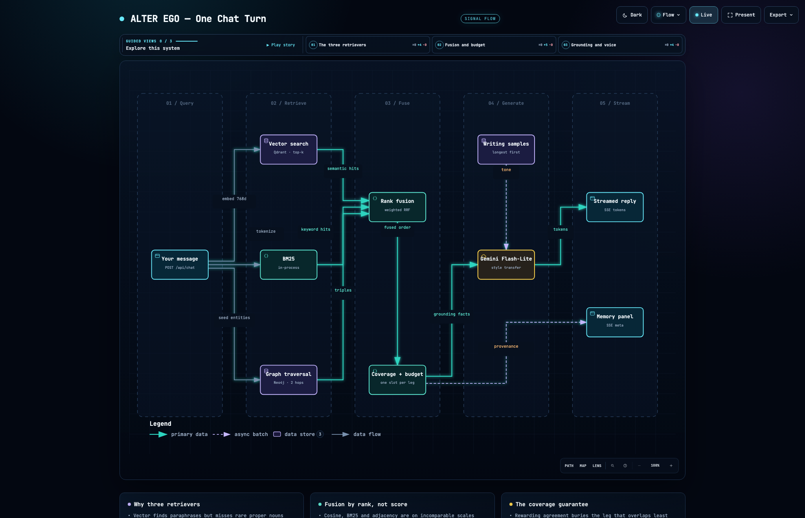
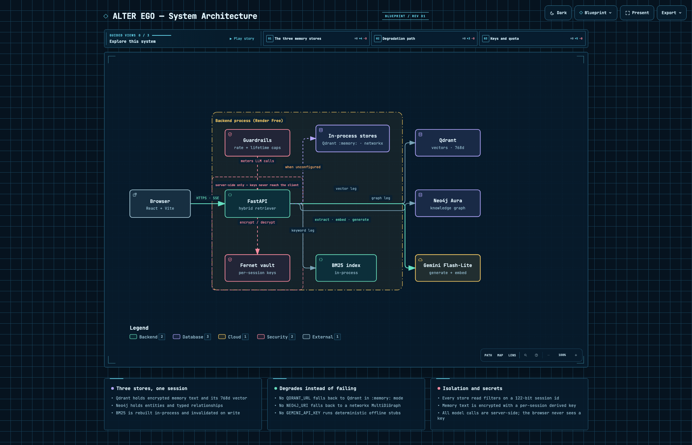
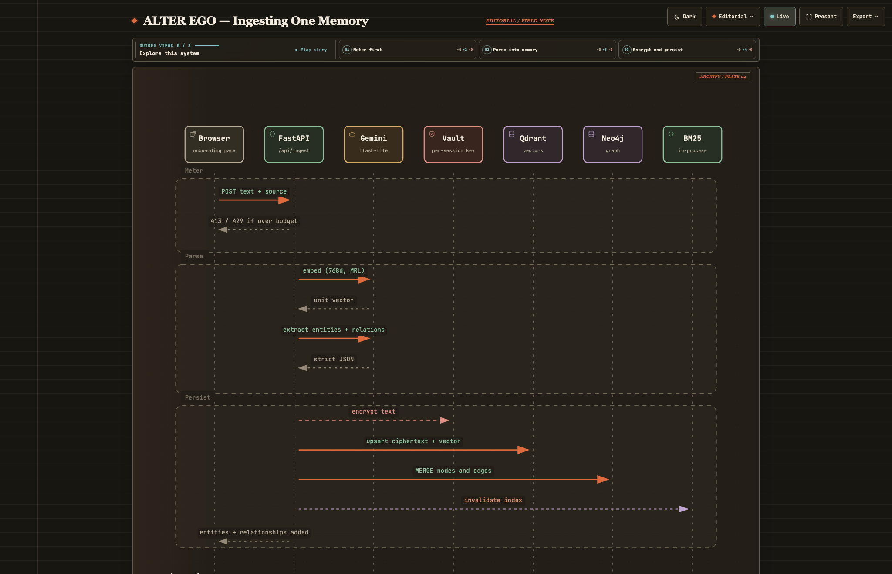

# ALTER EGO

A digital twin that remembers who you are and writes in your voice, built on a
hybrid memory system — **knowledge graph + vector + keyword** — running entirely
on free-tier services.

Give it a few writing samples and some facts about yourself, then chat with it.
Every message is parsed into structured memory across three stores. Every reply
is grounded in what those stores return and written in your tone. The interface
shows both halves of that as they happen: the knowledge graph growing live, and
the exact memories that produced each reply, tagged by which retriever found
them.

---

## How it works

A message fans out to three retrievers at once, their results merge into a
single ranking, and the winners become the grounding facts for a reply written
in your voice.



> Every diagram here is interactive — guided views, hover, export. Open
> [`diagrams/chat-turn.html`](diagrams/chat-turn.html) locally, or use the
> **How it works** tab in the running app. Sources are in
> [`diagrams/src/`](diagrams/src/); see [`diagrams/README.md`](diagrams/README.md)
> to regenerate.

### The three retrieval legs

Each leg is good at something the others are not, which is the whole point of
running all three.

| Leg | Finds | Fails at |
|---|---|---|
| **Vector** | Semantic matches — "what do you do?" recalls "I work at Meridian" | Rare proper nouns it has never seen in training |
| **Keyword (BM25)** | Exact names, jargon, project names | Paraphrases with no shared vocabulary |
| **Graph** | Multi-hop structure — who you work with, on what, where | Anything not expressible as an entity relationship |

Their scores are on incomparable scales (cosine similarity, BM25 saturation,
graph adjacency), so results are fused by **rank** rather than by score:

```
score(memory) = Σ over legs of  weight(leg) / (60 + rank(memory, leg))
```

Reciprocal Rank Fusion needs no per-leg normalisation and no tuning to behave
sensibly, and it gives exactly the property wanted here: a memory found by two
legs outranks one found by a single leg. The retrieved-memories panel shows
which legs found each result, so this is visible rather than asserted.

Rewarding agreement has one failure mode worth naming: it systematically buries
the leg whose results overlap least with the others. In a well-stocked session,
vector and keyword agree on the same verbatim memories and fill every slot,
while the graph's terse triples — which share almost no vocabulary with them —
are dropped entirely, taking the structural facts with them. So after fusion,
each leg that found something is guaranteed one slot, displacing the weakest
memory whose own legs remain covered without it.

### Recursive summarization

Once a session holds more than `SUMMARY_THRESHOLD` (12) live memories of a
kind, the oldest `SUMMARY_BATCH` (8) are compressed into a single `summary`
memory and flagged `summarized`, which removes them from recall without
deleting them. Summaries are compacted by the same rule, so a long session's
old context decays in resolution rather than disappearing.

The originals are only retired after the summary is durably stored, so a
failure mid-compaction loses nothing — it just retries next turn.

### Encryption at rest

Every memory's text is Fernet-encrypted before it leaves the process and
decrypted only server-side, when assembling LLM context or the memory panel.
The stored Qdrant payload field is `text_encrypted` and contains ciphertext —
`backend/tests/test_crypto.py` asserts that against the live store.

Keys are **per session**, HKDF-derived from the master `FERNET_KEY` using the
session id as salt. One session's key cannot decrypt another's, so a filter bug
in the store cannot produce readable text.

**Documented tradeoff:** graph entity labels (`Acme`, `Lisbon`, `Tidepool`) are
stored in **plaintext**. They drive the visualisation, they are queried by name
during traversal, and they are low-sensitivity relative to the raw text they
came from. Encrypting them would mean either decrypting the whole graph on
every read or giving up name-based traversal. The sentence *"I work at Meridian
as a senior product designer"* is ciphertext; the node `Meridian` is not.

### Where everything runs

Every external service is on a free tier, and every one is optional — an
unconfigured store falls back to an in-process equivalent behind the same
interface, so the app degrades instead of failing.



Interactive: [`diagrams/system.html`](diagrams/system.html)

### Adding a memory

Ingestion is two model calls — one embedding, one extraction. The text becomes
a vector *and* a set of typed graph edges, and the keyword index is invalidated
rather than rebuilt.



Interactive: [`diagrams/ingest.html`](diagrams/ingest.html)

### Session isolation

Sessions are anonymous and ephemeral — no accounts, no login. Each visitor gets
a 122-bit random `session_id`, which is the only credential: knowing it grants
access to that twin, and it is not guessable.

Every store access filters on it:

- **Qdrant** — all reads go through one `_session_filter()` helper; the only
  write that selects by point id also carries the session filter.
- **Neo4j** — every `MATCH` and `MERGE` binds `session_id`, on nodes *and* on
  relationships, including inside variable-length traversals.
- **BM25** — the index is built per session from that session's records only.

`backend/tests/test_isolation.py` verifies each leg independently, including
the case of seeding one session's traversal with another session's node key.

---

## Running it locally

Nothing external is required to start. Without credentials the app runs in
**offline mode**: an in-process Qdrant, an in-process networkx graph, and
deterministic stubs standing in for Gemini. Every feature works end to end —
replies are templated rather than generated, and the UI says so.

```bash
git clone <this repo> && cd alter-ego

# Backend
python3 -m venv .venv && source .venv/bin/activate
pip install -r backend/requirements-dev.txt
uvicorn backend.main:app --reload --port 8000

# Frontend (second terminal)
cd frontend && npm install && npm run dev
```

Open http://localhost:5173 and click **Load example persona**. Vite proxies
`/api` to the backend, so no frontend configuration is needed in development.

```bash
pytest          # 52 tests, all offline
```

### Going live with real services

Copy `.env.example` to `.env` and fill in what you have — each store upgrades
independently, so you can add them one at a time.

```bash
cp .env.example .env
python -c "from cryptography.fernet import Fernet; print(Fernet.generate_key().decode())"
```

| Variable | Where to get it | If unset |
|---|---|---|
| `GEMINI_API_KEY` | [AI Studio](https://aistudio.google.com/apikey) — free, no card | Templated replies, hashed embeddings |
| `NEO4J_URI` / `NEO4J_PASSWORD` | Neo4j Aura Free | In-process networkx graph, lost on restart |
| `QDRANT_URL` / `QDRANT_API_KEY` | Qdrant Cloud free cluster | In-process Qdrant, lost on restart |
| `FERNET_KEY` | Generate with the command above | Ephemeral key — memories unreadable after restart |

Set `FERNET_KEY` before pointing at a real Qdrant. Without it the app still
encrypts, but with a key that dies with the process, and everything written
becomes permanently unreadable on the next restart. The startup log says so.

---

## Deployment

1. **Push to GitHub.**
2. **Provision the free tiers:** a Neo4j Aura Free instance (save the URI and
   password), a Qdrant Cloud free cluster (save the URL and API key), and a
   Gemini API key from AI Studio.
3. **Backend on Render:** New → Blueprint → point at the repo. `render.yaml`
   defines the service; set the `sync: false` secrets in the dashboard,
   including `FRONTEND_ORIGIN` for CORS.
4. **Frontend on Vercel or Netlify:** import the repo. On Vercel set the root
   directory to `frontend/`; on Netlify `netlify.toml` handles it. Set
   `VITE_API_BASE` to the Render URL.
5. Smoke-test the live URL against the acceptance criteria below.

Render Free sleeps after 15 minutes idle and takes 10–30s to wake. The frontend
pings `/api/health` on load and retries while the service boots, showing a
"waking backend…" state.

### Free-tier limits worth knowing

| Service | Limit | What it means here |
|---|---|---|
| `gemini-3.5-flash-lite` | Large free daily allowance | Generation calls are serialised process-wide and retry 429s with jittered backoff |
| newer full-flash models | **~20 requests/day** on the free tier | Verified against a live key — `gemini-3.6-flash` returns a per-day quota error almost immediately. Check [ai.dev/rate-limit](https://ai.dev/rate-limit) before switching `GEMINI_CHAT_MODEL` |
| gemini-embedding-001 | ~1,500 req/day | Embeddings are batched; the persona loads in one call |
| Neo4j Aura Free | ~250MB, pauses after 7 days idle | Reactivate from the Aura console |
| Qdrant Cloud Free | 1GB | One collection, filtered by `session_id` |
| Render Free | 750 hrs/mo, sleeps at 15 min | Cold-start handling above |

Because the key is shared by every visitor, each session is metered: 8 requests
per minute, 60 per session lifetime, 2,000 characters per message. `/health`,
`/session` and `/graph` are free — they spend no model quota, so the graph can
refresh after every turn.

---

## API

Base path `/api`.

| Endpoint | Purpose |
|---|---|
| `GET /health` | `{status, offline}`. Also the warm-up ping. |
| `POST /session` | `{session_id}` — creates an anonymous session. |
| `POST /ingest` | `{session_id, text, source}` → `{memory_id, entities_added, relationships_added}` |
| `POST /load-example` | Seeds the bundled persona; returns counts and suggested questions. |
| `POST /chat` | SSE stream: `token` events, then one `meta` with retrieved memories and the graph delta. |
| `GET /graph?session_id=` | `{nodes, edges}` for the visualisation. |

`/chat` is a POST that streams `text/event-stream`. The native `EventSource`
API is GET-only, so the frontend parses the stream off a `fetch` ReadableStream
instead (`frontend/src/api.ts`).

---

## Deviations from the PRD

Three, each deliberate:

1. **`google-genai` instead of `google-generativeai`.** Google retired the
   latter; the current SDK is `google-genai`. Same models, same free tier.
2. **A strict-JSON extraction prompt instead of `LLMGraphTransformer`.**
   Section 10.1 permits either. The prompt is one model call rather than a
   chain, keeps `session_id` injection in our hands, and avoids putting
   `langchain-experimental` on a 512MB Render Free instance. This also means
   the LangChain orchestration layer is not used at all — each store is reached
   through a thin session-scoped adapter, which is all the abstraction three
   stores need.
3. **`fetch` + ReadableStream instead of `EventSource`.** The PRD asks for both
   `POST /chat` and native `EventSource`; `EventSource` cannot POST, so the two
   cannot both hold. POST won.

---

## Acceptance criteria

| Criterion | Status |
|---|---|
| New visitor loads the site, clicks **Load example persona**, gets a grounded styled reply in one interaction | ✅ `test_persona.py` |
| Ingesting a fact creates the expected nodes/edges, visible in the live graph within one refresh | ✅ `test_api.py::test_graph_endpoint_shape` |
| A reply reflects an earlier-stated fact and matches the samples' tone | ✅ requires `GEMINI_API_KEY` — verify manually |
| Retrieved-memories panel shows real memories tagged by source leg | ✅ `test_api.py::test_retrieved_memories_are_tagged_by_leg` |
| Two sessions never see each other's memories or graph | ✅ `test_isolation.py` (4 tests) |
| Stored memory text is encrypted at rest | ✅ `test_crypto.py::test_stored_payload_is_ciphertext` |
| Older messages compress into a summary and are still recalled | ✅ `test_summarize.py` |
| Runs on free tiers with no billing enabled | ✅ by construction |

The tone criterion is the one thing the offline suite cannot check — templated
replies have no tone to match. Everything else is asserted against the running
app.

---

## Layout

```
backend/
├── main.py              # routes, chat orchestration
├── config.py            # settings
├── deps.py              # Gemini client: serialisation, backoff, embeddings
├── offline.py           # deterministic stubs for keyless operation
├── guardrails.py        # rate limit, lifetime cap, length cap
├── persona.py           # the bundled example twin
├── ingestion/           # embed, extract, summarize
├── memory/              # graph_store, vector_store, keyword_store
├── retrieval/hybrid.py  # RRF fusion, dedupe, context budget
├── generation/          # few-shot style transfer
├── crypto/vault.py      # per-session Fernet keys
├── prompts/             # extraction, summarize, style_transfer
└── tests/               # 52 tests, no external services

diagrams/
├── src/*.json           # diagram sources (the regenerable truth)
└── *.html               # rendered interactive artifacts

frontend/src/
├── App.tsx              # three-pane shell, tabs, boot and warm-up
├── api.ts               # session, ingest, chat (SSE), graph
└── components/          # Onboarding, ChatPanel, GraphView,
                         # RetrievedMemories, HowItWorks, DiagramFrame
```

## Ideas not built

- Per-sentence provenance — trace each sentence of a reply to its source memory.
- Live sliders for the per-leg fusion weights (`LEG_WEIGHTS` in `hybrid.py`).
- Neo4j's native vector index, dropping Qdrant for a single-store hybrid.
- Export and import a twin as an encrypted JSON blob.
